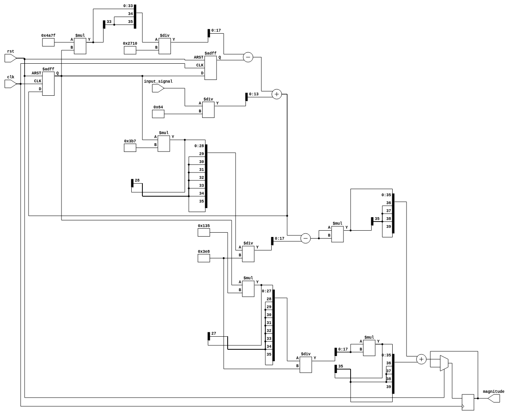

# goertzel-filter-vhdl
Design a Goertzel filter 

## Code file 
- matlab
- vhdl

## Netlist for the Goertzel Filder VHDL



## Dependencies

- [OSS CAD Build](https://github.com/YosysHQ/oss-cad-suite-build)

```bash
npm install -g netlistsvg svgexport
```

## Commands

```bash
make wave # to generate wave form for the goertzel filter

make svg # to generate netlist from vhdl
```